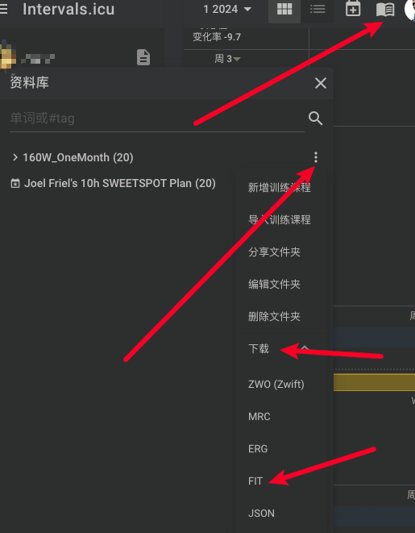

# igps_tools

[English](./README.md)

`igps_tools` 是一系列方便操作iGPS的工具。

- [workout](https://github.com/zzyandzzy/igps_tools/releases) 将[icu](https://intervals.icu/)上的训练计划导入到iGPS中

  使用教程
    - 从[icu](https://intervals.icu/)中下载并解压训练计划为FIT文件
      
    - 下载[workout](https://github.com/zzyandzzy/igps_tools/releases)二进制文件
    - 填入TOKEN（或者账号密码），执行workout二进制文件，如下所示：

```shell
# Use iGPS token
./workout --fit-zip ./fit.zip --token "Your iGPS token"
# Use iGPS username/password
./workout --fit-zip ./fit.zip --username "Your iGPS username" --password "Your iGPS password"
# 整体增加10w功率
./workout --fit-zip ./fit.zip --token "Your iGPS token" add power -v 10
# 整体增加10秒
./workout --fit-zip ./fit.zip --token "Your iGPS token" add duration -v 10
# 更多命令细节请查看
./workout --help
```

- [xingzhe](https://github.com/zzyandzzy/igps_tools/releases) Convert xingzhe history data to fit.

```shell
# Download 202305 data convert fit
./xingzhe -y 2023 -m 5 -u uid -c 'cookie'
```